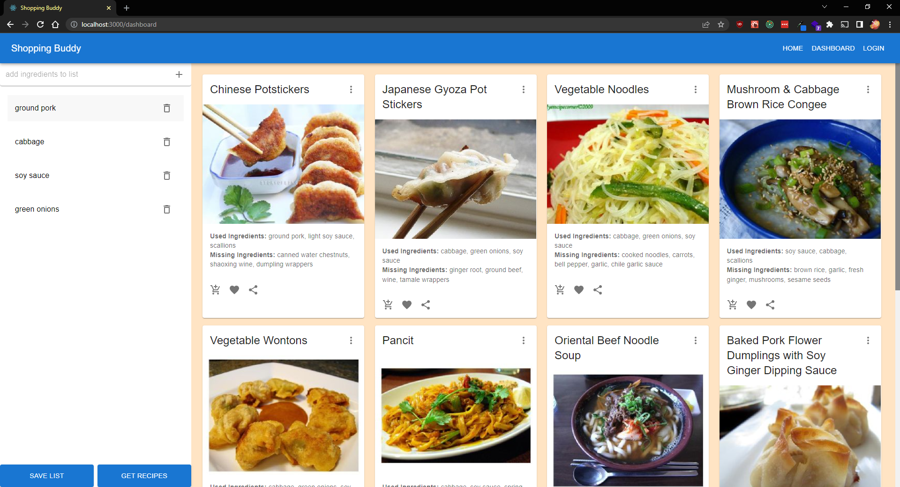

# 🛒 Shopping Buddy

## Description

Shopping Buddy is a web application that assist shoppers by allowing them to create & save shopping lists as well as provide them with inspiration on what recipes they can create using the items in their list. Current features include:

- Create & log into accounts (encrypted with bcrypt)
- Create & save shopping lists
- Fetch recipes from API based matching items in your list
- Add missing ingredient needed to create recipe to your shopping list
- Favorite recipes to account to view later



## Technologies

- Node & Express
- JWT & bcrypt
- MongoDB & Mongoose
- React w/ React Router & Redux
- Styled using MUI

## Getting started

- Create a .env file using the template, './.env.sample' & fill in with your own secrets
- install dependencies in both the main directory and the client directory

```
npm install && cd client && npm install
```

- start application server `npm run dev`
- index page will serve the client but you can also cd into the client directory to utilize CRA's webpack for hot module reloading (`npm start` from the client directory)
- `npm build` when you're done changing the client so that the deployed server can serve the production build

## Notes

- `herokupostbuild` script is specifically for deploying to heroku
